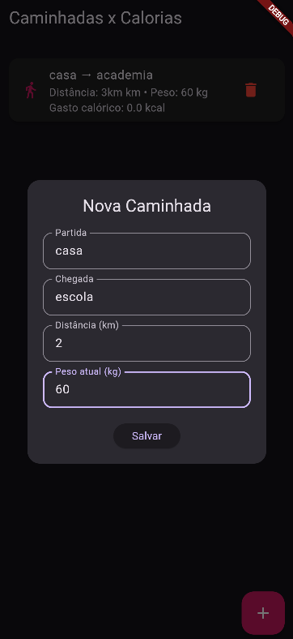
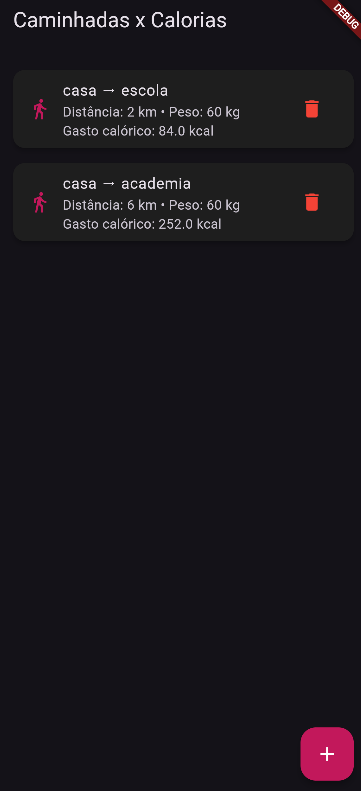

# Caminhada x Calorias

Aplicativo Flutter desenvolvido para acompanhar o histórico de caminhadas.
Permite registrar o ponto de partida, chegada, distância percorrida e peso atual, além de calcular automaticamente a média de calorias gastas.

## Prints





## Tecnologias
- Flutter SDK 3.12+
- shared_preferences (salvar dados localmente).
- fl_chart (gráficos de consumo).

# Passo a passo
- Clone este repositorio
- Abra com VsCode
- Em um terminal digite
- Instale as dependências: "flutter pub get"
- Execute o projeto: "flutter run"

```bash
git clone <url-do-repo>
flutter pub get
flutter run
```
